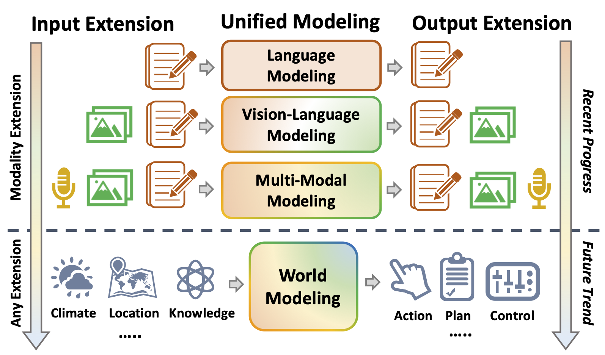
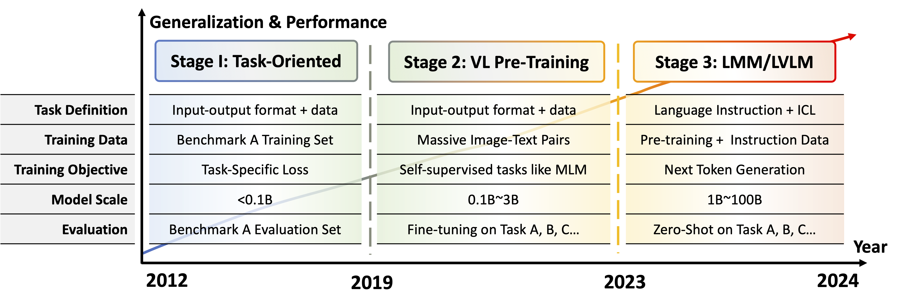

  <h1 style="display: inline-block; font-size: 32px;">Awesome-Large-Multimodal-Models</h1>

This repo summarizes the construction of current LMMs from the perspective of 

***input-output representation space extension***

* Based on the structure of input-output spaces, we systematically review the existing models, including main-stream models based on discrete-continuous hybrid spaces and models with unified multi-modal discrete representations. 
* Readers can refer to our [[📖 Preprint Paper](https://www.preprints.org/manuscript/202411.0685)] for detailed explanations.

    

## Table of Contents
- [Preliminary](#preliminary)
- [Awesome Models](#awesome-models)
  - [Large Vision-Language Models](#large-vision-language-models)
    - [With Text-only Output](#with-text-only-output)
    - [With Vision and Text Output](#with-vision-and-text-output)
  - [Large Audio-Language Models](#large-audio-language-models)
  - [Any Modality Models](#any-modality-models)

# Preliminary

As presented in Figure below, the evolution of multi-modal research paradigms could be divided into three stages. 

    

For readers to have a general picture about the development, we provide a tutorial here. The contents are summarized as follows:

* Part 1: [Vision-Language Pre-Training](https://github.com/FudanDISC/Awesome-Large-Multimodal-Models/blob/main/assets/tutorial-part1.pdf)
* Part 2: [Architectures and Traning of LMMs](https://github.com/FudanDISC/Awesome-Large-Multimodal-Models/blob/main/assets/tutorial-part2.pdf)
* Part 3: [Evaluation of LMMs](https://github.com/FudanDISC/Awesome-Large-Multimodal-Models/blob/main/assets/tutorial-part3.pdf)
* Part 4: [Further Capability of LMMs](https://github.com/FudanDISC/Awesome-Large-Multimodal-Models/blob/main/assets/tutorial-part4.pdf)
* Part 5: [Extension to Embodied Agents](https://github.com/FudanDISC/Awesome-Large-Multimodal-Models/blob/main/assets/tutorial-part5.pdf)

# Awesome Models

## Large Vision-Language Models

### With Text-only Output

|   **Large_Vision_Language_Model**  | **Code** | **Input Type** | **Output Type** | **LLM Backbone** | **Modality Encoder** | **Connection** | **Max** **Res.** | **Date** |
| :--------------------: | :--------: | :----------------: | :----: | :---: | :----------------: | :--------: | :--------: | :--------: |
| [Flamingo: a Visual Language Model for Few-Shot Learning](https://arxiv.org/abs/2204.14198) |[Github](https://github.com/lucidrains/flamingo-pytorch)|A|1| Chinchilla| NFNet| Perceiver| 480| 2022/04|
| [BLIP-2: Bootstrapping Language-Image Pre-training with Frozen Image Encoders and Large Language Models](https://arxiv.org/abs/2301.12597) |[Github](https://github.com/salesforce/LAVIS/tree/main/projects/blip2)|A|1| Flan-T5 / OPT | CLIP ViT-L/14 / Eva-CLIP ViT-G/14| Q-Former | 224| 2023/01|
| [LLaMA-Adapter: Efficient Fine-tuning of Language Models with Zero-init Attention](https://arxiv.org/abs/2303.16199)|[Github](https://github.com/OpenGVLab/LLaMA-Adapter)|A|1| LLaMA | CLIP-ViT-L/14| MLP| 224| 2023/03|
| [MiniGPT-4: Enhancing Vision-Language Understanding with Advanced Large Language Models](https://arxiv.org/abs/2304.10592)|[Github](https://github.com/Vision-CAIR/MiniGPT-4)|A|1| Vicuna| Eva-CLIP ViT-G/14| Q-Former | 224| 2023/04|
| [Visual Instruction Tuning](https://arxiv.org/abs/2304.08485)|[Github](https://github.com/haotian-liu/LLaVA)|A|1| Vicuna| CLIP ViT-L/14| Linear | 224| 2023/04|
| [mPLUG-Owl: Modularization Empowers Large Language Models with Multimodality](https://arxiv.org/abs/2304.14178)|[Github](https://github.com/X-PLUG/mPLUG-Owl)|A|1| LLaMA | CLIP ViT-L/14| Abstractor | 224| 2023/04|
| [LLaMA-Adapter V2: Parameter-Efficient Visual Instruction Model](https://arxiv.org/abs/2304.15010)|[Github](https://github.com/OpenGVLab/LLaMA-Adapter)|A|1| LLaMA | CLIP-ViT-L/14| MLP| 224| 2023/04|
| [InstructBLIP: Towards General-purpose Vision-Language Models with Instruction Tuning](https://arxiv.org/abs/2305.06500)|[Github](https://github.com/salesforce/LAVIS/tree/main/projects/instructblip)|A|1| Flan-T5 / Vicuna| Eva-CLIP ViT-G/14| Q-Former | 224| 2023/05|
| [Otter: A Multi-Modal Model with In-Context Instruction Tuning](https://arxiv.org/abs/2305.03726)|[Github](https://github.com/Luodian/otter)|A|1| LLaMA | CLIP ViT-L/14| Perceiver| 224| 2023/05|
| [Cheap and Quick: Efficient Vision-Language Instruction Tuning for Large Language Models](https://arxiv.org/pdf/2305.15023)|[Github](https://github.com/luogen1996/LaVIN)|A|1| LLaMA | CLIP ViT-L/14| MLP| 224| 2023/05|
| [MultiModal-GPT: A Vision and Language Model for Dialogue with Humans](https://arxiv.org/abs/2305.04790)|[Github](https://github.com/open-mmlab/Multimodal-GPT)|A|1| LLaMA | CLIP ViT-L/14| Perceiver| 224| 2023/05|
| [Shikra: Unleashing Multimodal LLM's Referential Dialogue Magic](https://arxiv.org/abs/2306.15195)|[Github](https://github.com/shikras/shikra)|A|1| Vicuna| CLIP ViT-L/14| Linear | 224| 2023/06|
| [Video-ChatGPT: Towards Detailed Video Understanding via Large Vision and Language Models](https://arxiv.org/abs/2306.05424)|[Github](https://github.com/mbzuai-oryx/Video-ChatGPT)|A|1| Vicuna| CLIP ViT-L/14| Linear | 224| 2023/06|
| [Valley: Video Assistant with Large Language model Enhanced abilitY](https://arxiv.org/pdf/2306.07207)|[Github](https://github.com/RupertLuo/Valley)|A|1| Stable-Vicuna | CLIP ViT-L/14| Temporal Module + Linear | 224| 2023/06|
| [What Matters in Training a GPT4-Style Language Model with Multimodal Inputs?](https://arxiv.org/abs/2307.02469)|[Github](https://github.com/bytedance/lynx-llm)|A|1| Vicuna| EVA-1B | Resampler| 420| 2023/07|
| [Qwen-VL: A Versatile Vision-Language Model for Understanding, Localization, Text Reading, and Beyond](https://arxiv.org/abs/2308.12966)|[Github](https://github.com/QwenLM/Qwen-VL)|A|1| Qwen| OpenCLIP ViT-bigG| Cross-Attention| 448| 2023/08|
| [BLIVA: A Simple Multimodal LLM for Better Handling of Text-Rich Visual Questions](https://arxiv.org/abs/2308.09936)|[Github](https://github.com/mlpc-ucsd/BLIVA)|A|1| Flan-T5 / Vicuna| Eva-CLIP ViT-G/14| Q-Former + MLP | 224| 2023/08|
| [IDEFICS](https://huggingface.co/blog/idefics)|[Huggingface](https://huggingface.co/blog/idefics)|A|1| LLaMA | OpenCLIP ViT-H/14| Perceiver| 224| 2023/08|
| [OpenFlamingo: An Open-Source Framework for Training Large Autoregressive Vision-Language Models](https://arxiv.org/abs/2308.01390)|[Github](https://github.com/mlfoundations/open_flamingo)|A|1| LLaMA, MPT| CLIP ViT-L/14| Perceiver| 224| 2023/08|
| [InternLM-XComposer: A Vision-Language Large Model for Advanced Text-image Comprehension and Composition](https://arxiv.org/pdf/2309.15112)|[Github](https://github.com/InternLM/InternLM-XComposer/tree/main/InternLM-XComposer-1.0)|A|1| InternLM| Eva-CLIP ViT-G/14| Perceiver| 224| 2023/09|
| [Improved Baselines with Visual Instruction Tuning](https://arxiv.org/abs/2310.03744)|[Github](https://github.com/haotian-liu/LLaVA)|A|1| Vicuna 1.5| CLIP ViT-L/14| MLP| 336| 2023/10|
| [MiniGPT-v2: large language model as a unified interface for vision-language multi-task learning](https://arxiv.org/abs/2310.09478)|[Github](https://github.com/Vision-CAIR/MiniGPT-4)|A|1| LLaMA-2 | EVA| Linear | 448| 2023/10|
| [Fuyu-8B: A Multimodal Architecture for AI Agents](https://www.adept.ai/blog/fuyu-8b)|[HF](https://huggingface.co/adept/fuyu-8b)|A|1| Persimmon | -| Linear | unlimited| 2023/10|
| [UReader: Universal OCR-free Visually-situated Language Understanding with Multimodal Large Language Model](https://arxiv.org/abs/2310.05126)|[Github](https://github.com/LukeForeverYoung/UReader)|A|1| LLaMA | CLIP ViT-L/14| Abstractor | 224*20 | 2023/10|
| [CogVLM: Visual Expert for Pretrained Language Models](https://arxiv.org/abs/2311.03079)|[Github](https://github.com/THUDM/CogVLM)|A|1| Vicuna 1.5| EVA2-CLIP-E| MLP| 490| 2023/11|
| [Monkey: Image Resolution and Text Label Are Important Things for Large Multi-modal Models](https://arxiv.org/abs/2311.06607)|[Github](https://github.com/Yuliang-Liu/Monkey)|A|1| Qwen| OpenCLIP ViT-bigG| Cross-Attention| 896| 2023/11|
| [ShareGPT4V:ImprovingLargeMulti-Modal Models with Better Captions](https://arxiv.org/pdf/2311.12793)|[Github](https://github.com/ShareGPT4Omni/ShareGPT4V)|A|1| Vicuna-1.5| CLIP ViT-L/14| MLP| 336| 2023/11|
| [mPLUG-Owl2: Revolutionizing Multi-modal Large Language Model with Modality Collaboration](https://arxiv.org/abs/2311.04257)|[Github](https://github.com/X-PLUG/mPLUG-Owl/tree/main/mPLUG-Owl2)|A|1| LLaMA-2 | CLIP ViT-L/14| Abstractor | 448| 2023/11|
| [SPHINX: The Joint Mixing of Weights, Tasks, and Visual Embeddings for Multi-modal Large Language Models](https://arxiv.org/abs/2311.07575)|[Github](https://github.com/Alpha-VLLM/LLaMA2-Accessory)|A|1| LLaMA-2 | CLIP ViT-L/14 + CLIP ConvNeXt-XXL + DINOv2 ViT-G/14 | Linear + Q-Former| 672| 2023/11|
| [InternVL: Scaling up Vision Foundation Models and Aligning for Generic Visual-Linguistic Tasks](https://arxiv.org/abs/2312.14238)|[Github](https://github.com/OpenGVLab/InternVL)|A|1| Vicuna| InternViT| QLLaMA / MLP | 336| 2023/12|
| [MobileVLM : A Fast, Strong and Open Vision Language Assistant for Mobile Devices](https://arxiv.org/abs/2312.16886)|[Github](https://github.com/Meituan-AutoML/MobileVLM)|A|1| MobileLLaMA | CLIP ViT-L/14| LDP (conv-based) | 336| 2023/12|
| [VILA: On Pre-training for Visual Language Models](https://arxiv.org/abs/2312.07533)|[Github](https://github.com/NVlabs/VILA)|A|1| LLaMA-2 | CLIP ViT-L | Linear | 336| 2023/12|
| [Osprey: Pixel Understanding with Visual Instruction Tuning](https://arxiv.org/pdf/2312.10032)|[Github](https://github.com/CircleRadon/Osprey)|A|1| Vicuna| CLIP ConvNeXt-L| MLP| 512| 2023/12|
| [Honeybee: Locality-enhanced Projector for Multimodal LLM](https://arxiv.org/abs/2312.06742)|[Github](https://github.com/khanrc/honeybee)|A|1| Vicuna-1.5| CLIP ViT-L/14| C-Abstractor / D -Abstractor | 336| 2023/12|
| [Omni-SMoLA: Boosting Generalist Multimodal Models with Soft Mixture of Low-rank Experts](https://arxiv.org/abs/2312.00968)|-|A|1| UL2 | Siglip ViT-G/14| Linear | 1064 | 2023/12|
| [LLaVA-NeXT: Improved reasoning, OCR, and world knowledge](https://llava-vl.github.io/blog/2024-01-30-llava-next/)|[Github](https://github.com/haotian-liu/LLaVA)|A|1| Vicuna / Mistral / Hermes-2-Yi| CLIP ViT-L/14| MLP| 672| 2024/01|
| [InternLM-XComposer2: Mastering Free-form Text-Image Composition and Comprehension in Vision-Language Large Model](https://arxiv.org/abs/2401.16420)|[Github](https://github.com/InternLM/InternLM-XComposer)|A|1| InternLM-2| CLIP ViT-L/14| MLP| 490| 2024/01|
| [MouSi: Poly-Visual-Expert Vision-Language Models](https://arxiv.org/abs/2401.17221) |[Github](https://github.com/FudanNLPLAB/MouSi)|A|1| Vicuna-1.5| CLIP ViT-L/14 + MAE + LayoutLMv3 + ConvNeXt + SAM + DINOv2 ViT-G | Poly-Expert Fusion | 1024 | 2024/01|
| [LLaVA-MoLE: Sparse Mixture of LoRA Experts for Mitigating Data Conflicts in Instruction Finetuning MLLMs](https://arxiv.org/abs/2401.16160) |[Github](https://github.com/forwchen/LLaVA-MoLE)|A|1| Vicuna1.5 | CLIP ViT-L/14| MLP| 336| 2024/01|
| [MoE-LLaVA: Mixture of Experts for Large Vision-Language Models](https://arxiv.org/abs/2401.15947) |[Github](https://github.com/PKU-YuanGroup/MoE-LLaVA)|A|1| StableL / Qwen / Phi-2| CLIP ViT-L/14| MLP| 336| 2024/01|
| [MobileVLM V2: Faster and Stronger Baseline for Vision Language Model](https://arxiv.org/abs/2402.03766) |[Github](https://github.com/Meituan-AutoML/MobileVLM)|A|1| MobileLLaMA | CLIP ViT-L/14| LDP v2 | 336| 2024/02|
| [Bunny: Efficient Multimodal Learning from Data-centric Perspective](https://arxiv.org/abs/2402.11530) |[Github](https://github.com/BAAI-DCAI/Bunny)|A|1| Phi-1.5 / LLaMA-3 / StableLM-2 / Phi-2 | SigLIP, EVA-CLIP | MLP| 1152 | 2024/02|
| [TinyLLaVA: A Framework of Small-scale Large Multimodal Models](https://arxiv.org/abs/2402.14289) |[Github](https://github.com/DLCV-BUAA/TinyLLaVABench)|A|1| TinyLLaMA / Phi-2 / StableLM-2| SigLIP-L, CLIP ViT-L | MLP| 336/384| 2024/02|
| [SPHINX-X: Scaling Data and Parameters for a Family of Multi-modal Large Language Models](https://arxiv.org/abs/2402.05935) |[Github](https://github.com/Alpha-VLLM/LLaMA2-Accessory)|A|1| TinyLLaMA / InternLM2 / LLaMA2 / Mixtral | CLIP ConvNeXt-XXL + DINOv2 ViT-G/14| Linear | 672| 2024/02|
| [Mini-Gemini: Mining the Potential of Multi-modality Vision Language Models](https://arxiv.org/abs/2403.18814) |[Github](https://github.com/dvlab-research/MGM)|A|1| Gemma / Vicuna / Mixtral / Hermes-2-Yi | CLIP ViT-L + ConvNext-L| Cross-Attention + MLP| 1536 | 2024/03|
| [DeepSeek-VL: Towards Real-World Vision-Language Understanding](https://arxiv.org/abs/2403.05525) |[Github](https://github.com/deepseek-ai/DeepSeek-VL)|A|1| Deepseek LLM | SigLIP-L, SAM-B| MLP| 1024 | 2024/03|
| [LLaVA-UHD: an LMM Perceiving Any Aspect Ratio and High-Resolution Images](https://arxiv.org/abs/2403.11703) |[Github](https://github.com/thunlp/LLaVA-UHD)|A|1| Vicuna| CLIP ViT-L/14| Perceiver| 336*6| 2024/03|
| [[Yi-VL] Yi: Open Foundation Models by 01.AI](https://arxiv.org/html/2403.04652v1) |[Github](https://github.com/01-ai/Yi)|A|1| Yi| CLIP ViT-H/14| MLP| 448| 2024/03|
| [MM1: Methods, Analysis & Insights from Multimodal LLM Pre-training](https://arxiv.org/abs/2403.09611) |[Github](https://github.com/kyegomez/MM1)|A|1| in-house LLM| CLIP ViT-H*| C-Abstractor | 1792 | 2024/03|
| [VL-Mamba: Exploring State Space Models for Multimodal Learning](https://arxiv.org/abs/2403.13600) |[Github](https://github.com/ZhengYu518/VL-Mamba)|A|1| Mamba LLM | CLIP-ViT-L / SigLIP-SO400M | VSS + MLP| 384| 2024/03|
| [Cobra: Extending Mamba to Multi-Modal Large Language Model for Efficient Inference](https://arxiv.org/abs/2403.14520) |[Github](https://github.com/h-zhao1997/cobra)|A|1| Mamba-Zephyr| DINOv2 + SigLIP| MLP| 384| 2024/03|
| [[InternVL 1.5] How Far Are We to GPT-4V? Closing the Gap to Commercial Multimodal Models with Open-Source Suites](https://arxiv.org/abs/2404.16821) |[Github](https://github.com/OpenGVLab/InternVL)|A|1| InternLM2 | InternViT-6B | MLP| 448*40 | 2024/04|
| [[Phi-3-Vision] Phi-3 Technical Report: A Highly Capable Language Model Locally on Your Phone](https://arxiv.org/abs/2404.14219) |[Github](https://github.com/microsoft/Phi-3CookBook)|A|1| Phi-3 | CLIP ViT-L/14| MLP| 336*16 | 2024/04|
| [PLLaVA : Parameter-free LLaVA Extension from Images to Videos for Video Dense Captioning](https://arxiv.org/abs/2404.16994) |[Github](https://github.com/magic-research/PLLaVA)|A|1| Vicuna / Mistral / Hermes-2-Yi| CLIP ViT-L/14| MLP + Adaptive Pooling | 336| 2024/04|
| [TextHawk: Exploring Efficient Fine-Grained Perception of Multimodal Large Language Models](https://arxiv.org/abs/2404.09204) |[Github](https://github.com/yuyq96/TextHawk)|A|1| InternLM-1| SigLIP-SO400M/14 | Resampler + MLP| unlimited| 2024/04|
| [Imp: Highly Capable Large Multimodal Models for Mobile Devices](https://arxiv.org/abs/2405.12107) |[Github](https://github.com/MILVLG/imp)|A|1| Phi-2 | SigLIP | MLP| 384| 2024/05|
| [[IDEFICS2] What matters when building vision-language models?](https://arxiv.org/abs/2405.02246) |[HF](https://huggingface.co/docs/transformers/en/model_doc/idefics2)|A|1| Mistral-v0.1| SigLIP-SO400M/14 | Perceiver + MLP| 384*4| 2024/05|
| [ConvLLaVA: Hierarchical Backbones as Visual Encoder for Large Multimodal Models](https://arxiv.org/abs/2405.15738) |[Github](https://github.com/alibaba/conv-llava)|A|1| Vicuna- | CLIP-ConvNeXt-L* | MLP| 1536 | 2024/05|
| [Ovis: Structural Embedding Alignment for Multimodal Large Language Model](https://arxiv.org/abs/2405.20797) |[Github](https://github.com/AIDC-AI/Ovis)|A|1| LLaMA3 / Qwen1.5| CLIP ViT-L + Visual Embedding | -| 336| 2024/05|
| [DeCo: Decoupling Token Compression from Semantic Abstraction in Multimodal Large Language Models](https://arxiv.org/abs/2405.20985) |[Github](https://github.com/yaolinli/DeCo)|A|1| Vicuna-1.5| CLIP ViT-L/14| MLP + Adaptive Pooling | 336| 2024/05|
| [CuMo: Scaling Multimodal LLM with Co-Upcycled Mixture-of-Experts](https://arxiv.org/abs/2405.05949) |[Github](https://github.com/SHI-Labs/CuMo)|A|1| Mistral / Mixtral | CLIP ViT-L/14| MLP| 336| 2024/05|
| [Cambrian-1: A Fully Open, Vision-Centric Exploration of Multimodal LLMs](https://arxiv.org/abs/2406.16860) |[Github](https://github.com/cambrian-mllm/cambrian)|A|1| Vicuna-1.5 / LLaMA-3 / Hermes-2-Yi | CLIP ViT-L/14 + DINOv2 ViT-L/14 + SigLIP ViT-SO400M + OpenCLIP ConvNeXt-XXL | Spatial Vision Aggregator | 1024 | 2024/06|
| [GLM-4v](https://arxiv.org/abs/2408.16500) |[Github](https://github.com/THUDM/GLM-4/blob/main/README_en.md)|A|1| GLM4| EVA-CLIP-E | Conv + SwiGLU| 1120 | 2024/06|
| [InternLM-XComposer-2.5: A Versatile Large Vision Language Model Supporting Long-Contextual Input and Output](https://arxiv.org/abs/2407.03320) |[Github](https://github.com/InternLM/InternLM-XComposer)|A|1| InternLM-2| CLIP ViT-L/14| MLP| 560*24 | 2024/07|
| [[IDEFICS3] Building and better understanding vision-language models: insights and future directions](https://arxiv.org/abs/2408.12637) |[HF](https://huggingface.co/docs/transformers/main/en/model_doc/idefics3)|A|1| LLaMA 3.1 | SigLIP-SO400M/14 | Perceiver + MLP| 1820 | 2024/08|
| [mPLUG-Owl3: Towards Long Image-Sequence Understanding in Multi-Modal Large Language Models](https://arxiv.org/abs/2408.04840) |[Github](https://github.com/X-PLUG/mPLUG-Owl)|A|1| Qwen2 | SigLIP-SO400M/14 | Linear | 384*6| 2024/08|
| [CogVLM2: Visual Language Models for Image and Video Understanding](https://arxiv.org/abs/2408.16500) |[Github](https://github.com/THUDM/CogVLM2)|A|1| LLaMA3| EVA-CLIP-E | Conv + SwiGLU| 1344 | 2024/08|
| [CogVLM2-vedio: Visual Language Models for Image and Video Understanding](https://arxiv.org/abs/2408.16500) |[Github](https://github.com/THUDM/CogVLM2)|A|1| LLaMA3| EVA-CLIP-E | Conv + SwiGLU| 224| 2024/08|
| [LLaVA-OneVision: Easy Visual Task Transfer](https://arxiv.org/abs/2408.03326) |[Github](https://github.com/LLaVA-VL/LLaVA-NeXT/blob/main/docs/LLaVA_OneVision.md)|A|1| Qwen-2| SigLIP-SO400M/14 | MLP| 384*36 | 2024/09|
| [Qwen2-VL: Enhancing Vision-Language Model's Perception of the World at Any Resolution](https://arxiv.org/abs/2409.12191) |[Github](https://github.com/QwenLM/Qwen2-VL)|A|1| Qwen-2| ViT-675M | MLP| unlimited| 2024/09|

### With Vision and Text Output

| **Large_Vision_Language_Model**| **Code** | **Input Type** | **Output Type** | **LLM Backbone** | **Modality Encoder** | **Modality Decoder** | **Date** |
| :--------------------: | :----: | :----------------: | :-----------------------------------: | :-------------------: | :-------: | :-------: | :-------: |
| [GILL: Generating Images with Multimodal Language Models](https://arxiv.org/abs/2305.17216) |[Github](https://github.com/kohjingyu/gill)|A|2| OPT| CLIP ViT-L| SD| 2023/05 |
| [Emu: Generative Pretraining in Multimodality](https://arxiv.org/abs/2307.05222) |[Github](https://github.com/baaivision/Emu)|A|2| LLaMA| EVA-02-CLIP-1B| SD| 2023/07 |
| [LaVIT: Unified Language-Vision Pretraining in LLM with Dynamic Discrete Visual Tokenization](https://arxiv.org/abs/2309.04669) |[Github](https://github.com/jy0205/LaVIT)|A|3| LLaMA| Eva-CLIP ViT-G/14 + LaVIT Tokenizer | LaVIT D e-Tokenizer | 2023/09 |
| [[CM3Leon] Scaling Autoregressive Multi-Modal Models: Pretraining and Instruction Tuning](https://arxiv.org/abs/2309.02591) |[Github](https://github.com/kyegomez/CM3Leon)|B|3| CM3Leon| Make-A-Scene| Make-A-Scene| 2023/09 |
| [DreamLLM: Synergistic Multimodal Comprehension and Creation](https://arxiv.org/abs/2309.11499) |[Github](https://github.com/RunpeiDong/DreamLLM)|A|2| Vicuna | CLIP ViT-L/14 | SD| 2023/09 |
| [Kosmos-G: Generating Images in Context with Multimodal Large Language Models](https://arxiv.org/abs/2310.02992) |[Github](https://github.com/xichenpan/Kosmos-G)|A|2| MAGNETO| CLIP ViT-L/14 | SD| 2023/10 |
| [SEED-LLaMA: Making LLaMA SEE and Draw with SEED Tokenizer](https://arxiv.org/abs/2310.01218) |[Github](https://github.com/AILab-CVC/SEED)|B|3| Vicuna / LLaMA-2 | SEED Tokenizer| SEED D e-Tokenizer| 2023/10 |
| [MiniGPT-5: Interleaved Vision-and-Language Generation via Generative Vokens](https://arxiv.org/abs/2310.02239) |[Github](https://github.com/eric-ai-lab/MiniGPT-5)|A|2| Vicuna | Eva-CLIP ViT-G/14 | SD| 2023/10 |
| [Emu-2: Generative Multimodal Models are In-Context Learners](https://arxiv.org/abs/2312.13286) |[Github](https://github.com/baaivision/Emu)|A|2| LLaMA| EVA-02-CLIP-E-plus| SDXL| 2023/12 |
| [Chameleon: Mixed-Modal Early-Fusion Foundation Models](https://arxiv.org/abs/2405.09818) |[Github](https://github.com/facebookresearch/chameleon)|B|3| Chameleon| Make-A-Scene| Make-A-Scene| 2024/05 |
| [MoMa: Efficient Early-Fusion Pre-training with Mixture of Modality-Aware Experts](https://arxiv.org/abs/2407.21770) |-|B|3| Chamelon | Make-A-Scene| Make-A-Scene | 2024/07 |
| [VILA-U: a Unified Foundation Model Integrating Visual Understanding and Generation](https://arxiv.org/abs/2409.04429) |[Github](https://github.com/mit-han-lab/vila-u)|B|3| LLaMA-2| SigLIP + RQ-VAE | RQ-VAE| 2024/09 |

## Large Audio-Language Models

| **Large_Audio_Language_Model** | **Code** | **Input Type** | **Output Type** | **Output Modality** | **Backbone** | **Modality Encoder** | **Modality Decoder** | **Date** |
| :--------------------: | :------: | :------: | :------: | :------: | :------: | :------: | :------: | :------: |
| [SpeechGPT: Empowering Large Language Models with Intrinsic Cross-Modal Conversational Abilities](https://arxiv.org/abs/2305.11000) | [Github](https://github.com/0nutation/SpeechGPT) | B| 3 | Text, Audio | LLaMA| HuBERT| Unit Vocoder | 2023/05|
| [Speech-LLaMA: On decoder-only architecture for speech-to-text and large language model integration](https://arxiv.org/abs/2307.03917) | - | A| 1 | Text| LLaMA| CTC compressor| -| 2023/07|
| [SALMONN: Towards Generic Hearing Abilities for Large Language Models](https://arxiv.org/abs/2310.13289) | [Github](https://github.com/bytedance/SALMONN) | A| 1 | Text| Vicuna | Whisper-Large-v2 + BEATs| -| 2023/10|
| [Qwen-Audio: Advancing Universal Audio Understanding via Unified Large-Scale Audio-Language Models](https://arxiv.org/abs/2311.07919) | [Github](https://github.com/QwenLM/Qwen-Audio) | A| 1 | Text| Qwen | Whisper-Large-v2| -| 2023/11|
| [SpeechGPT-Gen: Scaling Chain-of-Information Speech Generation](https://arxiv.org/abs/2401.13527) | [Github](https://github.com/0nutation/SpeechGPT) | B| 3 | Text, Audio | LLaMA-2| SpeechTokenizer | SpeechTokenizer| 2024/01|
| [SLAM-ASR: An Embarrassingly Simple Approach for LLM with Strong ASR Capacity](https://arxiv.org/abs/2402.08846) | [Github](https://github.com/X-LANCE/SLAM-LLM/blob/main/examples/asr_librispeech/README.md) | A| 1 | Text| LLaMA-2| HuBERT| -| 2024/02|
| [WavLLM: Towards Robust and Adaptive Speech Large Language Model](https://arxiv.org/abs/2404.00656) | [Github](https://github.com/microsoft/SpeechT5/tree/main/WavLLM) | A| 1 | Text| LLaMA-2| Whisper-Large-v2 + WavLM-Base | -| 2024/04|
| [SpeechVerse: A Large-scale Generalizable Audio Language Model](https://arxiv.org/abs/2405.08295) | - | A| 1 | Text| Flan-T5-XL | WavLM-Large / Best-RQ | -| 2024/05|
| [Qwen2-Audio Technical Report](https://arxiv.org/abs/2407.10759) | [Github](https://github.com/QwenLM/Qwen2-Audio) | A| 1 | Text| Qwen | Whisper-Large-v3| -| 2024/07|
| [LLaMA-Omni: Seamless Speech Interaction with Large Language Models](https://arxiv.org/abs/2409.06666) | [Github](https://github.com/ictnlp/LLaMA-Omni) | A| 2 | Text, Audio | LLaMA-3.1| Whisper-Large-v3| Unit Vocoder | 2024/09|

## Any Modality Models

|  **Any_Modality_Model** | **Code** | **Input Type** | **Output Type** | **Output Modality** | **Backbone**| **Modality Encoder**| **Modality Decoder** | **Date** |
| :--------------------: | :------: | :------: | :------: | :------: | :------: | :------: | :------: | :------: |
| [PandaGPT: One Model To Instruction-Follow Them All](https://arxiv.org/abs/2305.16355) |[Github](https://github.com/yxuansu/PandaGPT)| A| 1 | Text | Vicuna| ImageBind | -| 2023/05|
| [ImageBind-LLM: Multi-modality Instruction Tuning](https://arxiv.org/abs/2309.03905) |[Github](https://github.com/OpenGVLab/LLaMA-Adapter/tree/main/imagebind_LLM)| A| 1 | Text | Chinese-LLaMA | ImageBind + PointBind | -| 2023/09|
| [NExT-GPT: Any-to-Any Multimodal LLM](https://arxiv.org/abs/2309.05519) |[Github](https://github.com/NExT-GPT/NExT-GPT)| A| 2 | Text, Vision, Audio | Vicuna| ImageBind | SD + AudioLDM + Zeriscope| 2023/09|
| [CoDi-2: In-Context, Interleaved, and Interactive Any-to-Any Generation](https://arxiv.org/abs/2311.18775) |[Github](https://github.com/microsoft/i-Code/tree/main/CoDi-2)| A| 2 | Text, Vision, Audio | LLaMA-2 | ImageBind | SD + AudioLDM2 + zeroscope v2| 2023/11|
| [Unified-IO 2: Scaling Autoregressive Multimodal Models with Vision, Language, Audio, and Action](https://arxiv.org/abs/2312.17172) |[Github](https://github.com/allenai/unified-io-2)| A| 3 | Text, Vision, Audio | UnifiedIO2| OpenCLIP ViT-B + AST| VQ-GAN + V iT-VQGAN| 2023/12|
| [AnyGPT: Unified Multimodal LLM with Discrete Sequence Modeling](https://arxiv.org/abs/2402.12226) |[Github](https://github.com/OpenMOSS/AnyGPT)| B| 3 | Text, Vision, Audio | LLaMA-2 | SEED + Encodec + SpeechTokenizer| SEED + Encodec + SpeechTokenizer | 2024/02|
| [Uni-MoE: Scaling Unified Multimodal LLMs with Mixture of Experts](https://arxiv.org/abs/2405.11273) |[Github](https://github.com/HITsz-TMG/UMOE-Scaling-Unified-Multimodal-LLMs)| A| 1 | Text | LLaMA | CLIP ViT-L/14 + Whisper-small + BEATs | -| 2024/05|

